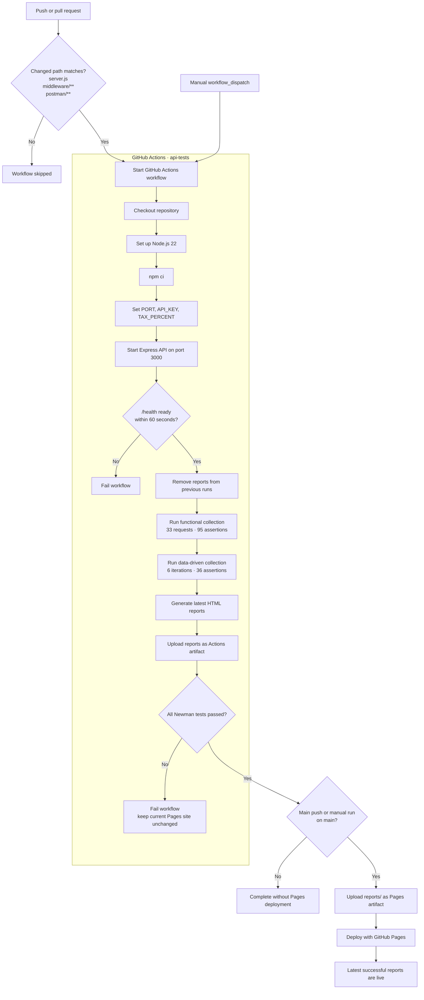

# Food Truck API — Postman & Newman Automation

A minimal Express API built as an API QA portfolio project. It demonstrates functional testing, data-driven testing, API chaining, Newman reporting, GitHub Actions, and GitHub Pages.

## CI/CD architecture

The Mermaid diagram is rendered as a vector by GitHub, so it remains sharp at any screen size.



Only `server.js`, `middleware/**`, and `postman/**` changes trigger CI automatically. Manual runs remain available. A newer run cancels an older run for the same branch, old HTML is removed before generation, and Pages is updated only after both Newman suites pass.

## Test automation

### Suites

| Suite | Scope | Execution |
| --- | --- | --- |
| Functional | End-to-end API behavior | 33 requests, 95 assertions |
| Data-driven login | Positive and negative login scenarios | 6 iterations, 36 assertions |

### Functional collection

| Folder | Validates |
| --- | --- |
| `00 Health` | Availability, JSON response, response time |
| `01 Authentication` | Registration, login, token extraction, invalid credentials |
| `02 Menu` | Item lookup, filters, sorting, pagination, invalid queries |
| `03 Orders` | CRUD, API key, bearer token, pricing calculations |
| `04 Bills` | Bill creation, receipt chaining, tax and total calculations |
| `05 Cleanup and Security Verification` | Deletion, logout, token invalidation |

Representative responses use JSON Schema validation. Assertions also verify field types, filtered values, sort order, pagination metadata, persistence, calculations, error codes, and authorization behavior.

### API chaining

```text
Register → userId → Login → token → Create Order → orderId
         → Generate Bill → billId → Receipt → Delete → Logout
```

Chained values are extracted with `pm.collectionVariables.set(...)`. The final request reuses the logged-out token and expects HTTP `401`.

### Variable scopes

| Scope | Variables |
| --- | --- |
| Environment | `baseUrl`, `apiKey` |
| Collection | `testEmail`, `testPassword`, `userId`, `token`, `orderId`, `billId` |
| Local/dynamic | `requestId`, `{{$randomUUID}}` |
| Iteration | Login inputs and expected results from JSON |

### Data-driven testing

Each object in [`test-data/login-test-data.json`](test-data/login-test-data.json) becomes one Newman iteration. The same login request compares the actual result with `expectedStatus`, `expectedSuccess`, `expectedMessage`, and `expectedErrorCode`.

An expected negative response, such as HTTP `401` for a wrong password, is a passing automated test.

### Reports

| Report | Location |
| --- | --- |
| Functional | [`reports/index.html`](reports/index.html) |
| Data-driven | [`reports/data-driven.html`](reports/data-driven.html) |

CI uploads both reports as the `newman-html-reports` artifact. The latest successful reports are also deployed to GitHub Pages.

## API surface

| Method | Endpoint | Protection |
| --- | --- | --- |
| GET | `/health` | None |
| POST | `/auth/register` | None |
| POST | `/auth/login` | None |
| POST | `/auth/logout` | Bearer token |
| GET | `/menu` | None |
| GET | `/menu/:id` | None |
| POST | `/orders` | Bearer token + API key |
| GET | `/orders/:id` | Bearer token + API key |
| PUT | `/orders/:id` | Bearer token + API key |
| DELETE | `/orders/:id` | Bearer token + API key |
| POST | `/bills` | Bearer token + API key |
| GET | `/bills/:billId/receipt` | Bearer token + API key |

`GET /menu` supports `category`, `available`, `minPrice`, `maxPrice`, `sort`, `page`, and `limit`.

## Local setup

Requirements: Node.js 22+ and npm.

```bash
git clone https://github.com/kushagrasinha123ks/food-truck-api.git
cd food-truck-api
npm install
PORT=3000 npm start
```

The API is available at `http://localhost:3000`.

Protected order and bill requests require:

```text
Authorization: Bearer <login token>
X-API-Key: foodtruck-qa-2026
```

### Run the tests

Keep the API running, then use another terminal:

```bash
npm run test:api
npm run test:data
npm run test:api:report
```

| Command | Result |
| --- | --- |
| `npm run test:api` | Functional collection in the CLI |
| `npm run test:data` | Data-driven collection and `reports/data-driven.html` |
| `npm run test:api:report` | Functional collection and `reports/index.html` |

## GitHub setup

1. Open **Settings → Pages**.
2. Set the source to **GitHub Actions**.
3. Push a matching change or run **Food Truck API Tests** manually from the Actions tab.

The workflow starts the API on the GitHub runner, executes both Newman suites, uploads the reports, and publishes Pages only when testing succeeds.
